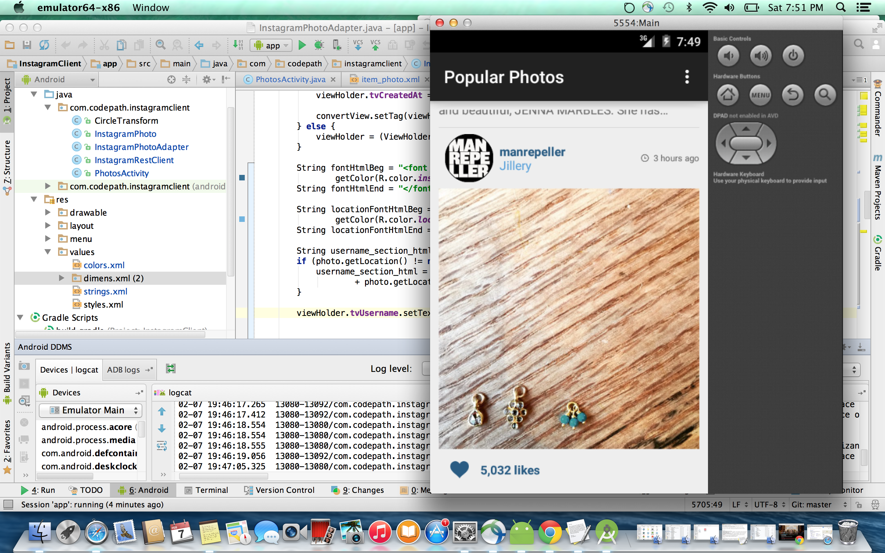

#Instagram Client Viewer (readonly) 

This is an Android demo application for viewing the most popular Instagram media, using the [Instagram API](http://instagram.com/developer/endpoints/)

Time Spent: ~20 - 22 hours 
Completed user stories:

 * [x] Required: User can scroll through current popular photos from Instagram
 * [x] Required: For each photo displayed, user can see the following details: Graphic, Caption, Username
 * [x] Optional: For each photo displayed, user can see the following details: relative timestamp, like count, user profile image
 * [x] Advanced: Add pull-to-refresh for popular stream with [SwipeRefreshLayout](http://guides.codepath.com/android/Implementing-Pull-to-Refresh-Guide)
 * [x] Advanced + Bonus: Show latest 2 comments for each photo 
 * [x] Advanced: Display each user profile image using a [RoundedImageView](https://github.com/vinc3m1/RoundedImageView)
 * [x] Advanced: Use [Picasso](http://square.github.io/picasso/) for loading photos and display a nice default placeholder graphic for each image during loading 
 * [x] Advanced: Allow user to view all comments for an image within a [dialogFragment](http://guides.codepath.com/android/Using-DialogFragment)
 
 * Made the images square using Picasso's resize() function using screen\_width, screen_width/aspectRatio
 * Attempted to get the location using the locations/search?lat=48.858844&lng=2.294351&client\_id=CLIENT_ID, and it worked for some cases. However, it turned out that some photos stored the English name directly without latitude and longitude and so I had to handle more cases here, which I didn't fully have the time for. (See image from a working case below) 
 * Made the hashtags in the caption blue. Attempted to make the @references blue. However, they were not captured by users\_in_photo or tags. It doesn't cover cases like #beautyPaegent #beauty because beauty is the first part of beautyPaegent, OR if the same tag is used multiple times. Currently, it does not actually linkify the tag, just colors it blue to look like the actual Instagram client.

Image from working case for location: 

Video walkthrough: 
 

